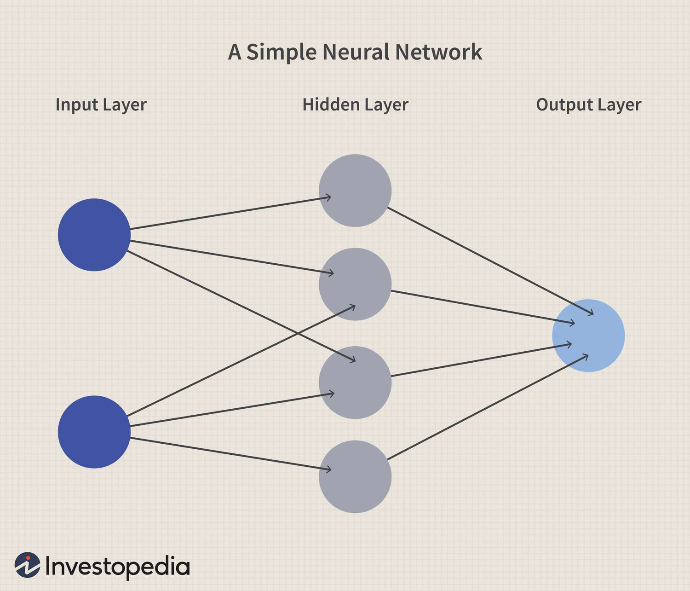

# Week 4 - Cool Stuff - AI!

Over the previous weeks, we have looked at Python and Streamlit and also setup a drawable canvas on the webpage. But, what about all the cool AI Stuff? That's where we will get into now!

## Machine Learning - A Primer

Let us start with a little bit on Machine Learning. It is a subfield of Artificial Intelligence, and you can do all sorts of cool stuff with it. It's a buzzword nowadays. Facial recognition, fingerprint recognition, object detection in images, etc. are all powered by machine learning. But what is it?

To understand ML from scratch, we would need lots of math, which is out of the scope of this project. But, we will still try and understand the concept as much as we can. In ML, we basically have three types of learning:

1) Supervised
2) Unsupervised
3) Reinforcement

**Supervised**: A supervised learning algorithm includes regression and classification algorithms. Here, we provide a mathematical model with some existing data points and then make use of mathematical functions and equations to predict where an unknown data point should lie. For example, For example, let’s say we have a dataset of house prices along with their sizes. In supervised learning, we can train a model on this data, where the size is the input feature and the price is the output we want to predict. Once the model is trained, we can input the size of a new house, and the model will predict its price.

**Unsupervised**: Unsupervised learning algorithms include clustering and association algorithms. Unlike supervised learning, unsupervised learning does not rely on labeled output data. Instead, it finds patterns and relationships in the input data. For example, let’s say we have a dataset of customers with their shopping habits but no specific output variable. An unsupervised learning algorithm can group these customers into clusters based on their shopping habits, helping us understand our customer base better.

**Reinforcement**: Reinforcement learning is a type of machine learning where an agent learns to make decisions by taking actions in an environment to maximize a reward. A classic example is a chess game. The agent makes a move (action), the environment (the chessboard) changes, and the agent gets a reward if it eventually wins the game.

In our project, we will mostly learn about and utilize Neural Networks, which can be considered a Supervised Learning Algorithm.

## What is a Neural Network?

A Neural Network is a computational model inspired by the human brain. It consists of interconnected nodes, or “neurons”, which work together to solve specific problems. NNs are particularly effective at processing complex data such as images, audio, and text.

### Structure of a Neural Network

A typical Neural Network consists of three types of layers:

**Input Layer**: This is where the network receives input from your dataset. Each neuron in this layer represents a unique feature from your dataset.

**Hidden Layer(s)**: These are the layers between the input and output layers. The neurons in these layers perform computations and transfer information from the input nodes to the output nodes.

**Output Layer**: The final layer in the network. It translates the computations from the hidden layers into the final output.



### Weights and biases

Weights and biases are crucial components of a Neural Network. They determine the strength and direction of the connections between neurons.

Weights: These are the parameters within the network that transform input data within the network's layers. Each connection between neurons has an associated weight.
Biases: These are additional parameters that allow the model to fit the data better by shifting the activation function.
During training, the network adjusts the weights and biases to minimize the error in its predictions.

### The Dot Product
The dot product is a fundamental operation in Neural Networks. It is used to calculate the weighted sum of inputs, which is then passed through an activation function.

Here's a simple example to illustrate the dot product:
```python
# List of inputs
inputs = [1.0, 2.0, 3.0]

# Corresponding weights
weights = [0.2, 0.8, -0.5]

# Bias
bias = 2.0

# Calculate the dot product
output = 0
for i, weight in zip(inputs, weights):
    output += weight*i

output += bias

print("Output:", output)
```

### Wrapping Up

In this session, we explored the basics of Machine Learning, including its three main types: Supervised, Unsupervised, and Reinforcement Learning. We then delved into Neural Networks, understanding their structure and the roles of weights and biases. Finally, we learned about the dot product, a fundamental operation in neural networks, with a simple example to illustrate its calculation.

By grasping these foundational concepts, you are now better equipped to understand and work with neural networks and other machine learning models. Keep experimenting and exploring to deepen your understanding and skills in this exciting field